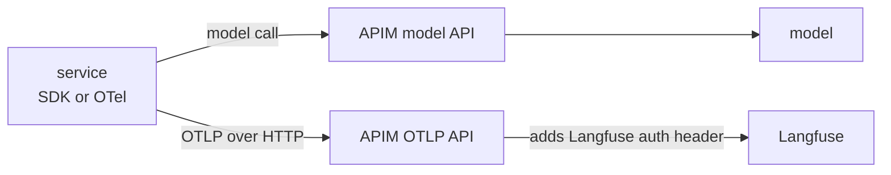
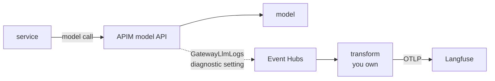
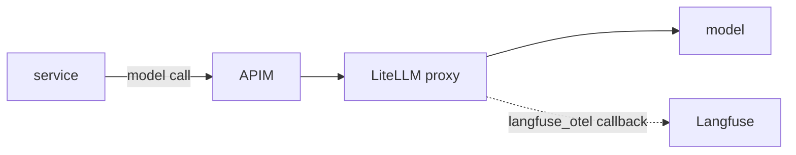

# Langfuse behind an Azure API Management AI gateway

[English](#english) | [한국어](#한국어)

## English

> **Reading page, not a lab.** Nothing on this page was run. Every fact was read from the
> public source linked in [Sources](#sources) on **2026-10-01**, when Langfuse v4.48.0 was the
> current server release. Statements marked *recommendation* are design advice, not vendor
> documentation.

### The question

More teams now send every model call through one Azure API Management (APIM) AI gateway
and want observability at that layer instead of in each application. The short answer:
**the gateway meters, it does not trace.** APIM sees independent HTTP requests. It can count
tokens, enforce quotas and log payloads, but it has no notion of a nested span, an agent step,
a tool call, a session or a user journey. Langfuse needs those to build a trace. So the design
question is not "gateway or application" but which path each kind of traffic takes into
Langfuse.

### What APIM records on its own

| Capability | APIM feature | What you get |
|---|---|---|
| Token rate limit / quota per consumer | `llm-token-limit` policy | 429 over the rate, 403 over the quota |
| Token metrics | `llm-emit-token-metric` policy | custom metrics in Application Insights, up to 5 dimensions |
| Semantic caching | `llm-semantic-cache-lookup` / `-store` | needs an external RediSearch-compatible cache |
| Content safety | `llm-content-safety` policy | Azure AI Content Safety check, 403 on detection |
| Load balancing, circuit breaker | backend pools | round-robin, weighted, priority, session-aware; 503 on trip |
| Request/response logging | `GatewayLlmLogs` category → table `ApiManagementGatewayLlmLog` | tokens, model, deployment, optionally the messages |

The older policy names (`azure-openai-token-limit`, `azure-openai-emit-token-metric`) now
redirect to the `llm-*` pages; use the new names.

### Three ways into Langfuse

| | A — instrument, forward through APIM | B — derive from gateway logs | C — LLM proxy behind APIM |
|---|---|---|---|
| Application change | yes, per service | none | none |
| Trace shape | nested spans, sessions, users | one flat span per request | one span per proxied call |
| Evaluations link to production traces | yes | only as far as the flat span allows | per call |
| Who owns the moving part | the services | the transform (your code) | the proxy (on the request path) |
| Documented by Langfuse | **yes** — the APIM integration page | no | yes — the LiteLLM page |

**A — application instrumentation, APIM as the telemetry egress point.** This is the pattern
Langfuse documents for APIM. Services export OpenTelemetry to an APIM-managed URL, and an APIM
API forwards the spans to Langfuse's OTLP endpoint with the credential attached at the gateway,
so services never hold Langfuse keys and all telemetry leaves through one approved point.

- Langfuse's OTLP trace endpoint is `/api/public/otel/v1/traces`, OTLP over **HTTP only**
  (`http/protobuf` or `http/json`); gRPC is not supported.
- At the gateway, add `Authorization: Basic <base64(public_key:secret_key)>` and
  `x-langfuse-ingestion-version: 4`. The Langfuse page says to do this "in the outbound
  policy"; Microsoft's `set-header` reference says headers for the request passed to the
  backend are set in the **inbound** section, so put them there.
- Services set `OTEL_EXPORTER_OTLP_ENDPOINT=https://<apim>.azure-api.net/<path>` and
  `OTEL_EXPORTER_OTLP_PROTOCOL=http/protobuf`; an APIM subscription key, if you require one,
  goes in `OTEL_EXPORTER_OTLP_HEADERS`.
- For a self-hosted Langfuse, point the APIM backend at your own instance instead of Langfuse
  Cloud. Langfuse's APIM FAQ states (as of July 2026) that there is no APIM-specific plugin,
  policy or exporter; this forwarding is the supported path.

**B — spans derived from APIM's LLM log.** For teams that have not instrumented yet.
`ApiManagementGatewayLlmLog` rows carry prompt, completion and total tokens, model name,
deployment name, optionally the request and response messages, a sequence number and a
`CorrelationId`. A transform reads them and writes one OTLP span per request.

- Getting the rows out: diagnostic settings can stream resource logs to Event Hubs, and
  `GatewayLlmLogs` is a listed category, but Microsoft's LLM-logging guide only shows a Log
  Analytics workspace as the destination. Treat Event Hubs for this category as the generic
  mechanism, not a documented recipe, and test it first.
- The `log-to-eventhub` policy is a different mechanism (it sends an expression you write),
  and it does not feed `ApiManagementGatewayLlmLog`.
- Messages over 32 KB arrive as 32 KB chunks with sequence numbers; reassemble by
  `CorrelationId` and `SequenceNumber` before building the span.
- The LLM log has **no session or user column**. Its `CorrelationId` joins to
  `ApiManagementGatewayLogs`, which has a `RequestHeaders` column; that join is where the
  correlation headers below have to come from. Check which headers your diagnostic
  configuration actually records.
- Langfuse v4 expects shared attributes (session, user) to be set on every span by the
  producer — the server no longer propagates them for OpenTelemetry input by default. The
  transform is the producer here, so it must set them on each span, using the attribute
  mapping in Langfuse's OpenTelemetry docs, and send `x-langfuse-ingestion-version: 4`.

**C — an LLM proxy behind APIM.** LiteLLM with Langfuse's recommended `langfuse_otel`
callback, configured with `LANGFUSE_PUBLIC_KEY`, `LANGFUSE_SECRET_KEY` and
`LANGFUSE_OTEL_HOST`. Set the host explicitly: the preset defaults to Langfuse's US cloud.
LiteLLM's OTel v2 page shows the preset alongside an opt-in `LITELLM_OTEL_V2=true` flag; whether
the callback needs it was not checked here. The proxy sits on the request path, so it needs the
same availability as the gateway.

*Recommendation:* use A for anything agentic, multi-step or user-facing — it is the only path
with full trace fidelity. Run B as a backstop so coverage is complete from day one, including
for teams that have not instrumented. Keep C for the case where "no application change" is a
hard requirement.

Langfuse is not a proxy: in A and B, model traffic goes from the application through APIM to
the model exactly as before, and telemetry travels out of band. Langfuse's APIM FAQ states that
a Langfuse outage does not affect LLM traffic. Short-lived processes still have to flush the SDK
before they exit, or their spans are lost.

### Agree the correlation contract before teams onboard

*Recommendation.* Pick a required header set at the gateway — a session ID, a user or tenant
ID, and the W3C `traceparent` — and make every path honour it:

- **A:** services put the same values on their spans (Langfuse's session and user attributes).
- **B:** the transform reads them from the gateway request log through `CorrelationId`.
- **C:** the proxy has to forward them to its Langfuse callback; check how your LiteLLM version
  maps request metadata to Langfuse session and user (not checked here).

This is what groups traffic by session and user in Langfuse, and what lets instrumented and
log-derived spans sit in one view. Retrofitting it across many teams later costs far more than
agreeing it now.

### Limits to plan for

- **Payload logging:** up to 32 KB per log entry; larger messages are split into 32 KB chunks;
  each request and response is capped at 2 MB. Long agent conversations reach this.
- **Tokens on streams:** logs and token metrics read usage from the model response, so a broken
  or terminated stream can log no count or a wrong one. Some OpenAI models omit usage when
  streaming unless `include_usage` is set. `llm-token-limit` estimates tokens for streamed
  requests instead.
- **Metric cardinality:** `llm-emit-token-metric` keeps at most 100 values per dimension and
  1,000 active time series per namespace, and discards data beyond that without an error. Do
  not use a user ID as a metric dimension; that belongs in the trace.
- **Claude through APIM:** the metering policies recognise the Anthropic Messages API schema only
  on APIM **v2 tiers**. Check your tier early; it constrains the rest of the design.
- **Cost on Azure OpenAI:** deployment names often differ from model names. Langfuse infers cost
  only when a model definition's `match_pattern` matches the generation's `model` value, so add
  custom model definitions for your deployment names or cost will be missing.

### Langfuse's own model calls through the same gateway

Langfuse's LLM connections support the Azure OpenAI provider and any OpenAI-compatible endpoint
with a custom base URL and headers. That means the Playground and LLM-as-a-judge evaluations can
also call models through APIM, so the gateway stays the single egress point. Three conditions
apply:

- **Tool calling:** for LLM-as-a-judge, the gateway must support OpenAI-format tool calling.
- **Private addresses:** Langfuse validates each connection URL against an SSRF deny-list that
  rejects private, loopback and link-local addresses and `*.internal`. A VNet-private APIM
  therefore needs an explicit allowance on a self-hosted Langfuse (`LANGFUSE_LLM_CONNECTION_WHITELISTED_HOST`,
  `_IPS` or `_IP_SEGMENTS`). Langfuse Cloud cannot relax the list.
- **Reachability:** the Langfuse deployment must be able to reach the gateway over the network.

### Entra ID: sign-in and provisioning

**Single sign-on works today on self-hosted Langfuse.**

| Setting | Value |
|---|---|
| Required | `AUTH_AZURE_AD_CLIENT_ID`, `AUTH_AZURE_AD_CLIENT_SECRET` (the secret's *value*, not its ID), `AUTH_AZURE_AD_TENANT_ID` |
| Redirect URI | `<NEXTAUTH_URL>/api/auth/callback/azure-ad` |
| Account linking | generic `AUTH_<PROVIDER>_ALLOW_ACCOUNT_LINKING`, here `AUTH_AZURE_AD_ALLOW_ACCOUNT_LINKING` |
| Enforce SSO | `AUTH_DISABLE_USERNAME_PASSWORD=true`, or per domain `AUTH_DOMAINS_WITH_SSO_ENFORCEMENT` |
| Identity | Langfuse identifies users by email: add the `email` claim to the token configuration |

**SCIM provisioning from Entra ID does not connect today.**

- **What Langfuse has:** SCIM endpoints under `/api/public/scim`. They are an Enterprise
  Edition feature on self-hosted, authenticated with Basic auth using organization-scoped API
  keys. The service provider config on `main` advertises `httpbasic` only, PATCH unsupported,
  and no `/Groups`. Langfuse's only IdP guide is for Okta.
- **What Entra ID requires:** Microsoft's SCIM guidance says username/password authentication is
  not supported for new gallery or non-gallery apps; Entra provisions with bearer tokens or
  OAuth.
- **Where it stands:** Langfuse maintainers confirmed the gap in
  [discussion #10838](https://github.com/orgs/langfuse/discussions/10838) (December 2025) and
  are tracking it as a feature idea, without a date. As of 2026-10-01 no Langfuse release
  mentions bearer authentication for SCIM.

**Until then — provisioning without SCIM:**

- New users sign in through Entra ID SSO. With `LANGFUSE_DEFAULT_ORG_ID` set they join that
  organization with `LANGFUSE_DEFAULT_ORG_ROLE` (default `VIEWER`). The project equivalents are
  `LANGFUSE_DEFAULT_PROJECT_ID` and `LANGFUSE_DEFAULT_PROJECT_ROLE`.
- A scheduled job that you own reads group membership from Microsoft Graph and sets roles
  through the membership APIs: `PUT /api/public/organizations/memberships` and
  `PUT /api/public/projects/{projectId}/memberships`. These need an organization-scoped key and
  are Enterprise Edition on self-hosted.
- Organizations and their API keys can be created through the Instance Management API
  (`ADMIN_API_KEY`, Enterprise Edition).
- [Lab 06 in `labs/v4/langfuse-ee`](../labs/v4/langfuse-ee/README.md) walks through the Org API and
  SCIM endpoints on a local stack.

### Where ClickHouse runs

Langfuse v4 requires **ClickHouse 25.12 or newer (26.4 recommended)**, PostgreSQL 15+ and
Redis 7.0+. Langfuse lists three officially supported ways to provide ClickHouse:

- **ClickHouse Cloud.** Azure public regions are `eastus2`, `westus3` and `germanywestcentral`.
  Private regions `australiaeast`, `japaneast` and `uaenorth` are available for the Enterprise
  tier on request. This is the region list as of the page's 2026-09-11 revision.
- **ClickHouse BYOC.** GA on Azure, in public regions only, across three availability zones.
- **Self-managed, through the official ClickHouse Kubernetes Operator** on AKS. The operator's
  latest release is v0.0.8 (2026-09-25).

If data must stay in an Azure region that is not on the Cloud or BYOC list, the operator on AKS
is the route.

The official Terraform module [`langfuse/langfuse-terraform-azure`](https://github.com/langfuse/langfuse-terraform-azure)
(1.0.5, 2026-09-28) takes that route by default:

- **What it creates:** AKS, PostgreSQL Flexible Server, Azure Managed Redis, a storage account,
  Application Gateway with WAF, Key Vault and DNS.
- **ClickHouse:** runs in-cluster through the operator; defaults are 3 replicas, 3 Keeper
  replicas, 100 Gi volumes, and 2 CPU / 8 Gi per replica. It can instead point at an external
  ClickHouse (`external_clickhouse`).
- **What it cannot do:** reuse an existing PostgreSQL, Redis or storage account; it always
  creates its own. In a landing zone with shared platform services, use the module as a
  reference architecture and deploy the Langfuse Helm chart on your own AKS.
- **Version lag:** release 1.0.5 pins Langfuse 4.46.0, behind the 4.48.0 server release.

### What Langfuse does not cover: vendor compliance feeds

A question that comes up next to gateway tracing is whether Langfuse can take in a vendor's
compliance feed, such as the Anthropic Compliance API. The two cover different traffic.

- **Anthropic Compliance API** (`/v1/compliance/*`, Activity Feed at `GET /v1/compliance/activities`):
  - **Covers:** activity inside Anthropic's own products — the organization's activity feed,
    claude.ai chats, files and projects, and session transcripts from Claude Code, Cowork and
    similar clients used with an Enterprise account.
  - **Who gets it:** Claude Enterprise organizations; eligible standalone Console organizations
    get the Activity Feed only.
  - **Does not cover:** prompts and responses from Claude API workloads authenticated with an
    API key — the traffic an application sends through APIM.
- **Langfuse** traces exactly that application traffic.

The two are complementary feeds with different consumers: security and compliance for the first,
engineering for the second. Bringing them together is something you build — for example a
scheduled poller that lands Activity Feed events in ClickHouse next to the gateway logs. For
aggregate usage and spend, Anthropic's Usage and Cost API (Admin API key) fits better than the
compliance feed.

### Sources

Read on 2026-10-01.

- Langfuse: [Azure API Management integration](https://langfuse.com/integrations/gateways/azure-api-management) ·
  [OpenTelemetry endpoint](https://langfuse.com/integrations/native/opentelemetry) ·
  [LLM connections](https://langfuse.com/docs/administration/llm-connection) ·
  [token and cost tracking](https://langfuse.com/docs/observability/features/token-and-cost-tracking) ·
  [LiteLLM proxy](https://langfuse.com/integrations/gateways/litellm) ·
  [authentication and SSO](https://langfuse.com/self-hosting/security/authentication-and-sso) ·
  [SCIM and Org API](https://langfuse.com/docs/administration/scim-and-org-api) ·
  [automated access provisioning](https://langfuse.com/self-hosting/administration/automated-access-provisioning) ·
  [Instance Management API](https://langfuse.com/self-hosting/administration/instance-management-api) ·
  [ClickHouse for self-hosting](https://langfuse.com/self-hosting/deployment/infrastructure/clickhouse) ·
  [v3 → v4 upgrade guide](https://langfuse.com/self-hosting/upgrade/upgrade-guides/upgrade-v3-to-v4) ·
  [discussion #10838](https://github.com/orgs/langfuse/discussions/10838) ·
  [langfuse-terraform-azure](https://github.com/langfuse/langfuse-terraform-azure)
- Microsoft: [AI gateway capabilities](https://learn.microsoft.com/en-us/azure/api-management/genai-gateway-capabilities) ·
  [`llm-token-limit`](https://learn.microsoft.com/en-us/azure/api-management/llm-token-limit-policy) ·
  [`llm-emit-token-metric`](https://learn.microsoft.com/en-us/azure/api-management/llm-emit-token-metric-policy) ·
  [`llm-semantic-cache-lookup`](https://learn.microsoft.com/en-us/azure/api-management/llm-semantic-cache-lookup-policy) ·
  [`llm-content-safety`](https://learn.microsoft.com/en-us/azure/api-management/llm-content-safety-policy) ·
  [backends](https://learn.microsoft.com/en-us/azure/api-management/backends) ·
  [LLM logs](https://learn.microsoft.com/en-us/azure/api-management/api-management-howto-llm-logs) ·
  [`ApiManagementGatewayLlmLog`](https://learn.microsoft.com/en-us/azure/azure-monitor/reference/tables/apimanagementgatewayllmlog) ·
  [`ApiManagementGatewayLogs`](https://learn.microsoft.com/en-us/azure/azure-monitor/reference/tables/apimanagementgatewaylogs) ·
  [diagnostic settings](https://learn.microsoft.com/en-us/azure/azure-monitor/platform/diagnostic-settings) ·
  [`log-to-eventhub`](https://learn.microsoft.com/en-us/azure/api-management/log-to-eventhub-policy) ·
  [`set-header`](https://learn.microsoft.com/en-us/azure/api-management/set-header-policy) ·
  [Entra SCIM provisioning](https://learn.microsoft.com/en-us/entra/identity/app-provisioning/use-scim-to-provision-users-and-groups)
- ClickHouse: [Cloud supported regions](https://clickhouse.com/docs/products/cloud/reference/supported-regions) ·
  [BYOC overview](https://clickhouse.com/docs/products/cloud/guides/infrastructure/deployment-options/byoc/overview) ·
  [Kubernetes Operator](https://clickhouse.com/docs/products/kubernetes-operator/overview) ·
  [operator releases](https://github.com/ClickHouse/clickhouse-operator/releases)
- Anthropic: [Compliance API](https://platform.claude.com/docs/en/manage-claude/compliance-api) ·
  [Activity Feed](https://platform.claude.com/docs/en/manage-claude/compliance-activity-feed) ·
  [integration patterns](https://platform.claude.com/docs/en/manage-claude/compliance-integration-patterns) ·
  [Usage and Cost API](https://platform.claude.com/docs/en/manage-claude/usage-cost-api)
- LiteLLM: [Langfuse integration](https://docs.litellm.ai/docs/observability/langfuse_integration) ·
  [OpenTelemetry v2](https://docs.litellm.ai/docs/observability/opentelemetry_v2)

---

## 한국어

> **실습이 아니라 읽기 자료입니다.** 이 페이지의 내용은 실행해 보지 않았습니다. 모든 사실은
> **2026-10-01**에 [Sources](#sources)의 공개 출처에서 읽었고, 당시 Langfuse 서버 최신 릴리스는
> v4.48.0이었습니다. *권고*로 표시한 문장은 설계 조언이며 벤더 문서가 아닙니다.

### 질문

모든 모델 호출을 하나의 Azure API Management(APIM) AI 게이트웨이로 보내고, 애플리케이션마다가
아니라 그 계층에서 관측성을 얻고 싶어 하는 팀이 늘고 있습니다. 짧은 답은 이렇습니다.
**게이트웨이는 계량(metering)은 하지만 트레이스는 만들지 않습니다.** APIM은 서로 독립된 HTTP
요청만 봅니다. 토큰을 세고, 쿼터를 걸고, 페이로드를 로깅할 수는 있지만 중첩 스팬·에이전트 단계·툴
호출·세션·사용자 여정이라는 개념이 없습니다. Langfuse가 트레이스를 만들려면 바로 그것들이
필요합니다. 그래서 설계의 질문은 "게이트웨이냐 애플리케이션이냐"가 아니라 트래픽 종류마다 어느
경로로 Langfuse에 들어오게 할지입니다.

### APIM이 자체적으로 기록하는 것

| 기능 | APIM 기능 | 얻는 것 |
|---|---|---|
| 소비자별 토큰 속도 제한·쿼터 | `llm-token-limit` 정책 | 속도 초과 시 429, 쿼터 초과 시 403 |
| 토큰 메트릭 | `llm-emit-token-metric` 정책 | Application Insights 커스텀 메트릭, 차원 최대 5개 |
| 시맨틱 캐싱 | `llm-semantic-cache-lookup` / `-store` | 외부 RediSearch 호환 캐시 필요 |
| 콘텐츠 안전성 | `llm-content-safety` 정책 | Azure AI Content Safety 검사, 탐지 시 403 |
| 로드 밸런싱·서킷 브레이커 | 백엔드 풀 | 라운드로빈·가중치·우선순위·세션 인지, 차단 시 503 |
| 요청/응답 로깅 | `GatewayLlmLogs` 카테고리 → `ApiManagementGatewayLlmLog` 테이블 | 토큰, 모델, 배포명, 선택적으로 메시지 |

예전 정책 이름(`azure-openai-token-limit`, `azure-openai-emit-token-metric`)은 이제 `llm-*`
페이지로 리다이렉트됩니다. 새 이름을 쓰세요.

### Langfuse로 들어오는 세 가지 경로

| | A — 계측 후 APIM 경유 전달 | B — 게이트웨이 로그에서 유도 | C — APIM 뒤 LLM 프록시 |
|---|---|---|---|
| 애플리케이션 변경 | 서비스마다 필요 | 없음 | 없음 |
| 트레이스 형태 | 중첩 스팬, 세션, 사용자 | 요청당 평평한 스팬 하나 | 프록시 호출당 스팬 하나 |
| 평가가 운영 트레이스에 연결 | 됨 | 평평한 스팬이 허용하는 만큼만 | 호출 단위 |
| 움직이는 부품의 소유자 | 각 서비스 | 변환기(직접 작성한 코드) | 프록시(요청 경로 위) |
| Langfuse 문서화 | **있음** — APIM 연동 페이지 | 없음 | 있음 — LiteLLM 페이지 |

**A — 애플리케이션 계측, APIM을 텔레메트리 출구로.** Langfuse가 APIM에 대해 문서화한
패턴입니다. 서비스가 APIM이 관리하는 URL로 OpenTelemetry를 내보내고, APIM API가 게이트웨이에서
인증 정보를 붙여 Langfuse OTLP 엔드포인트로 전달합니다. 서비스는 Langfuse 키를 갖지 않고, 모든
텔레메트리는 승인된 한 지점으로 나갑니다.

- Langfuse OTLP 트레이스 엔드포인트는 `/api/public/otel/v1/traces`이고, OTLP는 **HTTP만**
  지원합니다(`http/protobuf` 또는 `http/json`). gRPC는 지원하지 않습니다.
- 게이트웨이에서 `Authorization: Basic <base64(public_key:secret_key)>`와
  `x-langfuse-ingestion-version: 4`를 붙입니다. Langfuse 페이지는 "outbound 정책에서" 하라고
  쓰지만, Microsoft의 `set-header` 문서에 따르면 백엔드로 넘기는 요청의 헤더는 **inbound**
  섹션에서 설정하므로 inbound에 두세요.
- 서비스는 `OTEL_EXPORTER_OTLP_ENDPOINT=https://<apim>.azure-api.net/<path>`와
  `OTEL_EXPORTER_OTLP_PROTOCOL=http/protobuf`를 설정합니다. APIM 구독 키를 요구한다면
  `OTEL_EXPORTER_OTLP_HEADERS`에 넣습니다.
- 셀프호스팅 Langfuse라면 APIM 백엔드를 Langfuse Cloud 대신 자체 인스턴스로 지정합니다.
  Langfuse APIM FAQ는 (2026년 7월 기준) APIM 전용 플러그인·정책·익스포터가 없으며 이 전달 방식이
  지원 경로라고 밝힙니다.

**B — APIM LLM 로그에서 스팬 유도.** 아직 계측하지 않은 팀을 위한 경로입니다.
`ApiManagementGatewayLlmLog` 행에는 prompt·completion·total 토큰, 모델명, 배포명, 선택적으로
요청·응답 메시지, 시퀀스 번호, `CorrelationId`가 있습니다. 변환기가 이를 읽어 요청마다 OTLP
스팬 하나를 씁니다.

- 행을 꺼내는 방법: 진단 설정(diagnostic settings)은 리소스 로그를 Event Hubs로 스트리밍할 수
  있고 `GatewayLlmLogs`도 목록에 있는 카테고리입니다. 하지만 Microsoft의 LLM 로깅 가이드는 목적지로
  Log Analytics 워크스페이스만 보여 줍니다. 이 카테고리를 Event Hubs로 보내는 것은 문서화된
  레시피가 아니라 일반 메커니즘으로 보고, 먼저 테스트하세요.
- `log-to-eventhub` 정책은 별개의 메커니즘이며(직접 쓴 식을 보냅니다)
  `ApiManagementGatewayLlmLog`를 채우지 않습니다.
- 32 KB를 넘는 메시지는 시퀀스 번호가 붙은 32 KB 청크로 들어옵니다. 스팬을 만들기 전에
  `CorrelationId`와 `SequenceNumber`로 다시 합칩니다.
- LLM 로그에는 **세션·사용자 컬럼이 없습니다.** `CorrelationId`는 `ApiManagementGatewayLogs`와
  조인되고, 그 테이블에 `RequestHeaders` 컬럼이 있습니다. 아래 correlation 헤더는 이 조인을 통해
  가져와야 합니다. 진단 구성이 실제로 어떤 헤더를 기록하는지 확인하세요.
- Langfuse v4는 공유 속성(세션, 사용자)을 생산자가 모든 스팬에 설정한다고 가정합니다. 기본값에서
  서버는 OpenTelemetry 입력에 대해 이를 더 이상 전파하지 않습니다. 여기서는 변환기가 생산자이므로,
  Langfuse OpenTelemetry 문서의 속성 매핑에 따라 각 스팬에 이를 설정하고
  `x-langfuse-ingestion-version: 4`를 보내야 합니다.

**C — APIM 뒤의 LLM 프록시.** LiteLLM에 Langfuse가 권장하는 `langfuse_otel` 콜백을 쓰고,
`LANGFUSE_PUBLIC_KEY`, `LANGFUSE_SECRET_KEY`, `LANGFUSE_OTEL_HOST`로 설정합니다. 이 프리셋의
기본 호스트는 Langfuse US 클라우드이므로 호스트를 명시하세요. LiteLLM OTel v2 페이지는 이 프리셋을
옵트인 플래그 `LITELLM_OTEL_V2=true`와 함께 보여 주는데, 콜백에 이 플래그가 필요한지는 여기서
확인하지 않았습니다. 프록시는 요청 경로 위에 있으므로 게이트웨이와 같은 수준의 가용성이 필요합니다.

*권고:* 에이전트형·다단계·사용자 대면 워크로드에는 A를 쓰세요. 트레이스 충실도가 온전한 유일한
경로입니다. 아직 계측하지 않은 팀까지 포함해 첫날부터 커버리지를 채우려면 B를 보조 경로로 함께
운영하세요. C는 "애플리케이션 변경 불가"가 확정 요건일 때를 위해 남겨 두세요.

Langfuse는 프록시가 아닙니다. A와 B에서 모델 트래픽은 지금처럼 애플리케이션에서 APIM을 거쳐 모델로
가고, 텔레메트리는 그 경로 밖으로 따로 흐릅니다. Langfuse APIM FAQ는 Langfuse 장애가 LLM 트래픽에
영향을 주지 않는다고 밝힙니다. 다만 수명이 짧은 프로세스는 종료 전에 SDK를 flush해야 스팬이
사라지지 않습니다.

### 팀 온보딩 전에 correlation 규약을 합의하세요

*권고.* 게이트웨이에서 필수 헤더 세트를 정하세요. 세션 ID, 사용자 또는 테넌트 ID, W3C
`traceparent`입니다. 그리고 모든 경로가 이를 따르게 합니다.

- **A:** 서비스가 같은 값을 스팬에 넣습니다(Langfuse의 세션·사용자 속성).
- **B:** 변환기가 `CorrelationId`로 게이트웨이 요청 로그에서 읽어 옵니다.
- **C:** 프록시가 이를 Langfuse 콜백으로 넘겨야 합니다. 사용 중인 LiteLLM 버전이 요청 메타데이터를
  Langfuse 세션·사용자로 어떻게 매핑하는지 확인하세요(여기서는 확인하지 않았습니다).

이 규약이 있어야 Langfuse에서 세션·사용자별로 묶이고, 계측한 스팬과 로그에서 유도한 스팬이 한
화면에 모입니다. 나중에 여러 팀에 소급 적용하는 비용은 지금 합의하는 비용보다 훨씬 큽니다.

### 계획에 넣어야 할 한계

- **페이로드 로깅:** 로그 항목당 최대 32 KB이고, 더 큰 메시지는 32 KB 청크로 나뉩니다. 요청과
  응답은 각각 2 MB가 상한입니다. 긴 에이전트 대화는 여기에 닿습니다.
- **스트림의 토큰:** 로그와 토큰 메트릭은 모델 응답에서 사용량을 읽으므로, 스트림이 끊기거나
  종료되면 값이 없거나 틀릴 수 있습니다. 일부 OpenAI 모델은 `include_usage`를 켜지 않으면
  스트리밍 시 사용량을 생략합니다. `llm-token-limit`은 스트리밍 요청의 토큰을 대신 추정합니다.
- **메트릭 카디널리티:** `llm-emit-token-metric`은 차원당 값 100개, 네임스페이스당 활성 시계열
  1,000개까지만 유지하고, 그 이상은 오류 없이 버립니다. 사용자 ID를 메트릭 차원으로 쓰지 마세요.
  그 정보는 트레이스에 있어야 합니다.
- **APIM을 통한 Claude:** 계량 정책은 Anthropic Messages API 스키마를 APIM **v2 티어**에서만
  인식합니다. 티어를 일찍 확인하세요. 나머지 설계를 제약합니다.
- **Azure OpenAI의 비용:** 배포명은 모델명과 다른 경우가 많습니다. Langfuse는 모델 정의의
  `match_pattern`이 generation의 `model` 값과 맞을 때만 비용을 추론하므로, 배포명에 맞춘 커스텀
  모델 정의를 추가하지 않으면 비용이 비어 있습니다.

### Langfuse 자체의 모델 호출도 같은 게이트웨이로

Langfuse의 LLM connections는 Azure OpenAI 프로바이더와, 커스텀 base URL·헤더를 쓰는 모든
OpenAI 호환 엔드포인트를 지원합니다. 그래서 Playground와 LLM-as-a-judge 평가도 APIM을 통해 모델을
호출할 수 있고, 게이트웨이가 유일한 출구로 유지됩니다. 세 가지 조건이 있습니다.

- **툴 호출:** LLM-as-a-judge를 쓰려면 게이트웨이가 OpenAI 형식의 툴 호출을 지원해야 합니다.
- **사설 주소:** Langfuse는 연결 URL마다 SSRF 차단 목록으로 검증하며, 사설·루프백·링크 로컬
  주소와 `*.internal`을 거부합니다. 따라서 VNet 내부 전용 APIM은 셀프호스팅 Langfuse에서 명시적
  허용이 필요합니다(`LANGFUSE_LLM_CONNECTION_WHITELISTED_HOST`, `_IPS`, `_IP_SEGMENTS`).
  Langfuse Cloud에서는 이 목록을 완화할 수 없습니다.
- **도달성:** Langfuse 배포가 네트워크상 게이트웨이에 닿을 수 있어야 합니다.

### Entra ID: 로그인과 프로비저닝

**SSO는 지금 셀프호스팅 Langfuse에서 동작합니다.**

| 설정 | 값 |
|---|---|
| 필수 | `AUTH_AZURE_AD_CLIENT_ID`, `AUTH_AZURE_AD_CLIENT_SECRET`(시크릿 ID가 아니라 *값*), `AUTH_AZURE_AD_TENANT_ID` |
| 리디렉션 URI | `<NEXTAUTH_URL>/api/auth/callback/azure-ad` |
| 계정 연결 | 일반 규칙 `AUTH_<PROVIDER>_ALLOW_ACCOUNT_LINKING`, 여기서는 `AUTH_AZURE_AD_ALLOW_ACCOUNT_LINKING` |
| SSO 강제 | `AUTH_DISABLE_USERNAME_PASSWORD=true`, 또는 도메인별 `AUTH_DOMAINS_WITH_SSO_ENFORCEMENT` |
| 식별 | Langfuse는 이메일로 사용자를 식별합니다. 토큰 구성에 `email` 클레임을 추가하세요 |

**Entra ID의 SCIM 프로비저닝은 현재 연결되지 않습니다.**

- **Langfuse 쪽:** `/api/public/scim` 아래에 SCIM 엔드포인트가 있습니다. 셀프호스팅에서는
  Enterprise Edition 기능이고, 조직 범위 API 키를 쓰는 Basic 인증입니다. `main`의 service
  provider config는 `httpbasic`만 광고하고, PATCH는 미지원이며 `/Groups`가 없습니다. Langfuse의
  IdP 가이드는 Okta용뿐입니다.
- **Entra ID 쪽:** Microsoft SCIM 가이드는 새 갤러리·비갤러리 앱에서 사용자명/비밀번호 인증을
  지원하지 않는다고 밝히며, Entra는 bearer 토큰이나 OAuth로 프로비저닝합니다.
- **현황:** Langfuse 메인테이너는
  [discussion #10838](https://github.com/orgs/langfuse/discussions/10838)(2025년 12월)에서 이
  공백을 확인했고 일정 없이 기능 아이디어로 추적하고 있습니다. 2026-10-01 기준 SCIM bearer 인증을
  언급한 Langfuse 릴리스는 없습니다.

**그때까지 — SCIM 없이 프로비저닝하기:**

- 새 사용자는 Entra ID SSO로 로그인합니다. `LANGFUSE_DEFAULT_ORG_ID`를 설정하면 그 조직에
  `LANGFUSE_DEFAULT_ORG_ROLE`(기본 `VIEWER`)로 들어갑니다. 프로젝트용으로는
  `LANGFUSE_DEFAULT_PROJECT_ID`와 `LANGFUSE_DEFAULT_PROJECT_ROLE`이 있습니다.
- 직접 운영하는 스케줄 잡이 Microsoft Graph에서 그룹 멤버십을 읽어 멤버십 API로 역할을
  설정합니다. `PUT /api/public/organizations/memberships`와
  `PUT /api/public/projects/{projectId}/memberships`이며, 조직 범위 키가 필요하고 셀프호스팅에서는
  Enterprise Edition입니다.
- 조직과 조직 API 키는 Instance Management API(`ADMIN_API_KEY`, Enterprise Edition)로 만들 수
  있습니다.
- [`labs/v4/langfuse-ee`의 랩 06](../labs/v4/langfuse-ee/README.md)에서 로컬 스택으로 Org API와 SCIM
  엔드포인트를 따라가 볼 수 있습니다.

### ClickHouse를 어디서 운영할까

Langfuse v4에는 **ClickHouse 25.12 이상(권장 26.4)**, PostgreSQL 15 이상, Redis 7.0 이상이
필요합니다. Langfuse가 공식 지원하는 ClickHouse 제공 방식은 세 가지입니다.

- **ClickHouse Cloud.** Azure 퍼블릭 리전은 `eastus2`, `westus3`, `germanywestcentral`입니다.
  프라이빗 리전 `australiaeast`, `japaneast`, `uaenorth`는 Enterprise 티어에 요청 시 제공됩니다.
  페이지의 2026-09-11 개정 기준 목록입니다.
- **ClickHouse BYOC.** Azure에서 GA이며, 퍼블릭 리전에서만 가용 영역 3개에 걸쳐 배포됩니다.
- **셀프매니지드, 공식 ClickHouse Kubernetes Operator 사용**(AKS). 오퍼레이터 최신 릴리스는
  v0.0.8(2026-09-25)입니다.

데이터를 Cloud·BYOC 목록에 없는 Azure 리전에 둬야 한다면 AKS 위의 오퍼레이터가 그 경로입니다.

공식 Terraform 모듈 [`langfuse/langfuse-terraform-azure`](https://github.com/langfuse/langfuse-terraform-azure)
(1.0.5, 2026-09-28)는 기본값으로 이 경로를 씁니다.

- **만드는 것:** AKS, PostgreSQL Flexible Server, Azure Managed Redis, 스토리지 계정, WAF가 있는
  Application Gateway, Key Vault, DNS.
- **ClickHouse:** 오퍼레이터를 통해 클러스터 안에서 실행합니다. 기본값은 레플리카 3, Keeper
  레플리카 3, 볼륨 100 Gi, 레플리카당 2 CPU / 8 Gi입니다. 대신 외부 ClickHouse를 가리킬 수도
  있습니다(`external_clickhouse`).
- **못 하는 것:** 기존 PostgreSQL·Redis·스토리지 계정을 재사용하지 못하고 항상 새로 만듭니다.
  공유 플랫폼 서비스가 있는 랜딩 존이라면 모듈은 참조 아키텍처로 보고, 자체 AKS에 Langfuse Helm
  차트로 배포하세요.
- **버전 지연:** 릴리스 1.0.5는 Langfuse 4.46.0을 고정하고 있어 서버 최신 4.48.0보다 뒤처집니다.

### Langfuse가 다루지 않는 것: 벤더 컴플라이언스 피드

게이트웨이 트레이싱과 함께 자주 나오는 질문이, Langfuse가 Anthropic Compliance API 같은 벤더
컴플라이언스 피드를 받을 수 있느냐는 것입니다. 둘은 서로 다른 트래픽을 다룹니다.

- **Anthropic Compliance API**(`/v1/compliance/*`, Activity Feed는 `GET /v1/compliance/activities`):
  - **다루는 것:** Anthropic 자체 제품 안의 활동입니다. 조직 활동 피드, claude.ai의 대화·파일·
    프로젝트, Enterprise 계정으로 쓴 Claude Code·Cowork 같은 클라이언트의 세션 기록입니다.
  - **대상:** Claude Enterprise 조직입니다. 조건을 갖춘 독립 Console 조직은 Activity Feed만 받습니다.
  - **다루지 않는 것:** API 키로 인증한 Claude API 워크로드의 프롬프트와 응답입니다. 애플리케이션이
    APIM을 통해 보내는 바로 그 트래픽입니다.
- **Langfuse**는 정확히 그 애플리케이션 트래픽을 트레이스합니다.

둘은 소비자가 다른 상호 보완적인 피드입니다. 앞의 것은 보안·컴플라이언스 팀이, 뒤의 것은 엔지니어링
팀이 씁니다. 둘을 한곳에 모으는 것은 직접 만들어야 합니다. 예를 들어 Activity Feed 이벤트를
게이트웨이 로그 옆 ClickHouse에 적재하는 스케줄 폴러입니다. 집계 단위의 사용량·비용에는 컴플라이언스
피드보다 Anthropic Usage and Cost API(Admin API 키)가 더 맞습니다.

### 출처

2026-10-01에 읽었습니다. 목록은 영어 섹션의 [Sources](#sources)와 같습니다.
